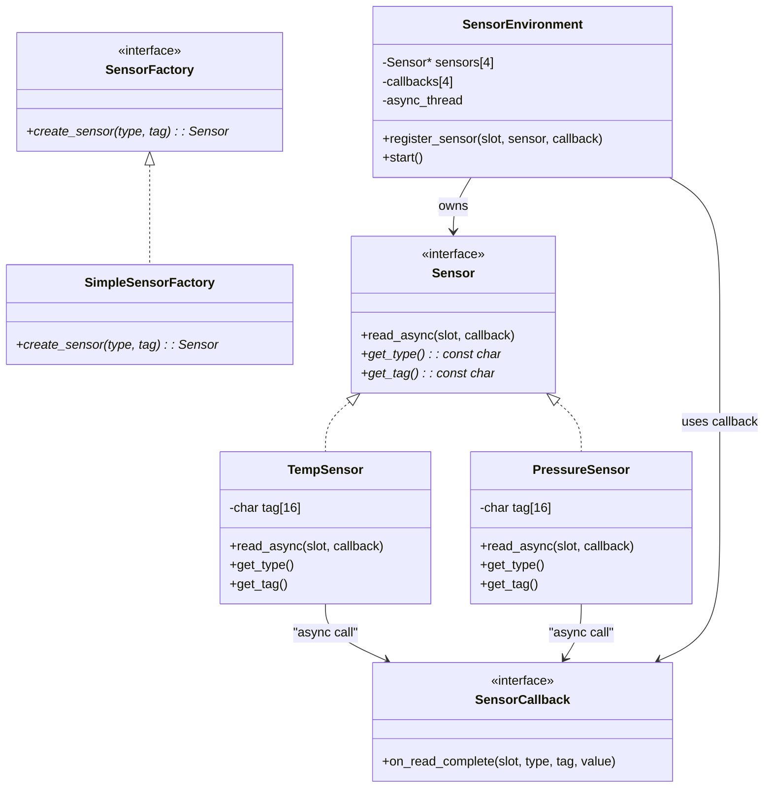
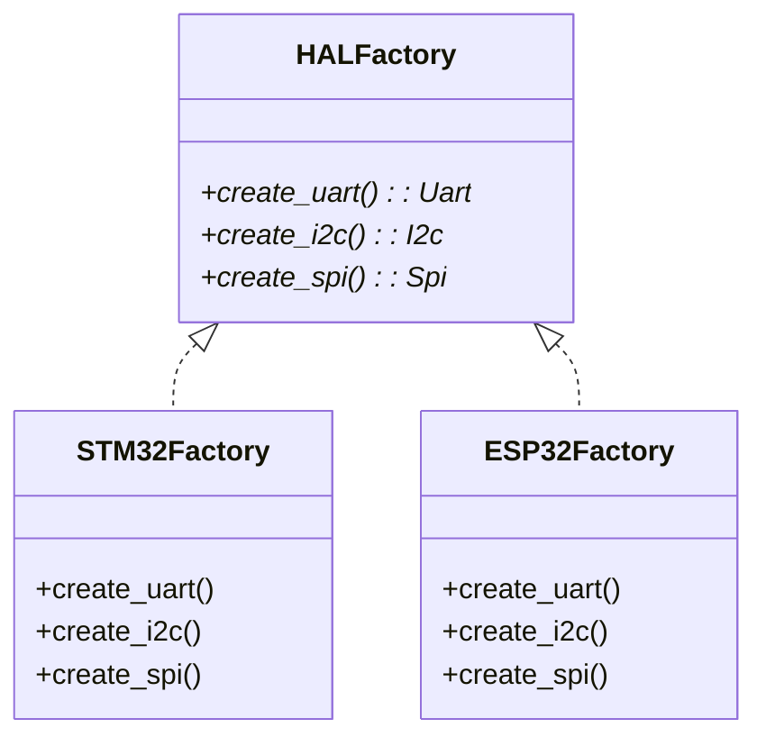

# 设计模式


## 创建型模式

### 工厂方法

工厂模式，整个代码就像一个个工厂一样，我需要什么东西就让那个工厂制作什么东西。我需要创建在嵌入式开发中，很多的场景都会运用到工厂方法，工厂方法作为一个简单的模式，是非常适合新手去实现的。下面贴上一段代码来进行模拟嵌入式的场景。

```c
/* sensor_factory_async.c
   Factory Method + object pool + IRQ-style async callbacks (no malloc).
   Compile: gcc -std=c11 -O2 sensor_factory_async.c -o sensor_factory_async
*/

#include <stdio.h>
#include <stdint.h>
#include <string.h>
#include <stdbool.h>
#include <unistd.h> /* usleep for demo */

#ifdef _WIN32
#include <windows.h>
#define usleep(us) Sleep((us) / 1000)
#endif

/* ---------- 抽象与回调类型 ---------- */

typedef struct Sensor Sensor;

/* 回调签名：当异步读取完成后调用（在“线程/主循环”上下文执行） */
typedef void (*sensor_callback_t)(Sensor *s, float value, void *ctx);

typedef struct
{
    void (*init)(Sensor *self);
    float (*read)(Sensor *self); /* 同步读取（转换/模拟） */
    const char *(*type_name)(Sensor *self);
    void (*deinit)(Sensor *self);
} SensorVTable;

struct Sensor
{
    const SensorVTable *vptr;
    int id; /* 池索引 */
    /* 异步支持 */
    sensor_callback_t cb;
    void *cb_ctx;
    bool async_enabled;
};

/* ---------- 具体传感器：温度 ---------- */

typedef struct
{
    Sensor base;
    int16_t raw;
    int16_t calibration_offset;
} TempSensor;

static void temp_init(Sensor *s)
{
    TempSensor *t = (TempSensor *)s;
    t->raw = 250;
    t->calibration_offset = 0;
}
static float temp_read(Sensor *s)
{
    TempSensor *t = (TempSensor *)s;
    return (t->raw + t->calibration_offset) / 10.0f;
}
static const char *temp_name(Sensor *s)
{
    (void)s;
    return "TempSensor";
}
static void temp_deinit(Sensor *s) { (void)s; }

static const SensorVTable temp_vtable = {
    .init = temp_init,
    .read = temp_read,
    .type_name = temp_name,
    .deinit = temp_deinit};

/* ---------- 具体传感器：压力 ---------- */

typedef struct
{
    Sensor base;
    uint16_t pressure_raw;
    uint8_t range_kpa;
} PressureSensor;

static void pres_init(Sensor *s)
{
    PressureSensor *p = (PressureSensor *)s;
    p->pressure_raw = 1013;
    p->range_kpa = 100;
}
static float pres_read(Sensor *s)
{
    PressureSensor *p = (PressureSensor *)s;
    return p->pressure_raw / 10.0f;
}
static const char *pres_name(Sensor *s)
{
    (void)s;
    return "PressureSensor";
}
static void pres_deinit(Sensor *s) { (void)s; }

static const SensorVTable pres_vtable = {
    .init = pres_init,
    .read = pres_read,
    .type_name = pres_name,
    .deinit = pres_deinit};

/* ---------- 对象池（无 malloc） ---------- */

#define POOL_SIZE 6
#define MAX_OBJ_SIZE ((sizeof(PressureSensor) > sizeof(TempSensor)) ? sizeof(PressureSensor) : sizeof(TempSensor))

static uint8_t pool[POOL_SIZE][MAX_OBJ_SIZE];
static bool pool_used[POOL_SIZE] = {0};

static int pool_alloc_slot(void)
{
    for (int i = 0; i < POOL_SIZE; ++i)
    {
        if (!pool_used[i])
        {
            pool_used[i] = true;
            return i;
        }
    }
    return -1;
}
static void pool_free_slot(int idx)
{
    if (idx >= 0 && idx < POOL_SIZE)
    {
        pool_used[idx] = false;
        memset(pool[idx], 0, MAX_OBJ_SIZE);
    }
}

/* ---------- 工厂函数 ---------- */

Sensor *create_temp_sensor(int *out_id)
{
    int slot = pool_alloc_slot();
    if (slot < 0)
        return NULL;
    TempSensor *t = (TempSensor *)(void *)pool[slot];
    memset(t, 0, sizeof(TempSensor));
    t->base.vptr = &temp_vtable;
    t->base.id = slot;
    t->base.cb = NULL;
    t->base.cb_ctx = NULL;
    t->base.async_enabled = false;
    t->raw = 0;
    t->calibration_offset = 0;
    t->base.vptr->init((Sensor *)t);
    if (out_id)
        *out_id = slot;
    return (Sensor *)t;
}

Sensor *create_pressure_sensor(int *out_id)
{
    int slot = pool_alloc_slot();
    if (slot < 0)
        return NULL;
    PressureSensor *p = (PressureSensor *)(void *)pool[slot];
    memset(p, 0, sizeof(PressureSensor));
    p->base.vptr = &pres_vtable;
    p->base.id = slot;
    p->base.cb = NULL;
    p->base.cb_ctx = NULL;
    p->base.async_enabled = false;
    p->pressure_raw = 0;
    p->range_kpa = 0;
    p->base.vptr->init((Sensor *)p);
    if (out_id)
        *out_id = slot;
    return (Sensor *)p;
}

void destroy_sensor(Sensor *s)
{
    if (!s)
        return;
    int slot = s->id;
    if (s->vptr && s->vptr->deinit)
        s->vptr->deinit(s);
    pool_free_slot(slot);
}

/* ---------- 事件队列（ISR 推入，主循环处理） ---------- */

#define EVENT_QUEUE_DEPTH 32

typedef struct
{
    Sensor *sensor;
    float value;
} SensorEvent;

static SensorEvent event_queue[EVENT_QUEUE_DEPTH];
static volatile int eq_head = 0; /* next to pop */
static volatile int eq_tail = 0; /* next to push */

/* 在 ISR 上下文调用：尽量小，返回是否推入成功（false => 丢弃事件） */
static bool isr_push_event(Sensor *s, float val)
{
    int next = (eq_tail + 1) % EVENT_QUEUE_DEPTH;
    if (next == eq_head)
    {
        /* 队列满 — 在 ISR 中不能阻塞，丢弃事件或计统计 */
        return false;
    }
    event_queue[eq_tail].sensor = s;
    event_queue[eq_tail].value = val;
    /* 简单的内存屏障（在裸机上可能为简短指令）*/
    __sync_synchronize();
    eq_tail = next;
    return true;
}

/* 主循环调用，处理并调用用户回调（非 ISR） */
static void process_event_queue(void)
{
    while (eq_head != eq_tail)
    {
        SensorEvent ev = event_queue[eq_head];
        eq_head = (eq_head + 1) % EVENT_QUEUE_DEPTH;
        /* 调用注册的回调（如果有） */
        if (ev.sensor && ev.sensor->cb && ev.sensor->async_enabled)
        {
            ev.sensor->cb(ev.sensor, ev.value, ev.sensor->cb_ctx);
        }
    }
}

/* ---------- 硬件中断模拟：在 ISR 中读取硬件并 push_event ---------- */

/* 真实系统中，这个函数会在 ISR 中被调用（或被 ISR 标记/触发）。
   对于示例，我们在 main 的循环中调用它来模拟中断触发。
*/
void hardware_trigger_sensor(Sensor *s)
{
    if (!s)
        return;
    /* ISR: 读取原始数据（通过 vptr->read），然后 push 到队列。
       注意：在真实 ISR 中，可能需要读取硬件寄存器/ADC 而不是调用复杂函数。
    */
    float val = s->vptr->read(s); /* 同步转换，假设快 */
    bool pushed = isr_push_event(s, val);
    (void)pushed; /* 可以统计丢弃率 */
}

/* ---------- 异步 API（供客户端使用） ---------- */

/* 启动异步采样（注册回调） */
void sensor_start_async(Sensor *s, sensor_callback_t cb, void *ctx)
{
    if (!s)
        return;
    s->cb = cb;
    s->cb_ctx = ctx;
    s->async_enabled = true;
}

/* 停止异步采样 */
void sensor_stop_async(Sensor *s)
{
    if (!s)
        return;
    s->async_enabled = false;
    s->cb = NULL;
    s->cb_ctx = NULL;
}

/* ---------- 客户端回调示例 ---------- */

static void my_sensor_cb(Sensor *s, float value, void *ctx)
{
    const char *tag = (const char *)ctx;
    printf("[callback] slot=%d type=%s tag=%s value=%.2f\n", s->id, s->vptr->type_name(s), tag ? tag : "(null)", value);
}

/* ---------- 测试主程序（模拟主循环 + 硬件触发） ---------- */

int main(void)
{
    /* 创建一些传感器 */
    Sensor *t1 = create_temp_sensor(NULL);
    Sensor *p1 = create_pressure_sensor(NULL);
    Sensor *t2 = create_temp_sensor(NULL);

    if (!t1 || !p1 || !t2)
    {
        printf("create failed\n");
        return 1;
    }

    /* 注册异步回调（开始异步模式） */
    sensor_start_async(t1, my_sensor_cb, "T1");
    sensor_start_async(p1, my_sensor_cb, "P1");
    sensor_start_async(t2, my_sensor_cb, "T2");

    /* 主循环：我们每次循环随机“硬件触发”若干传感器，然后处理队列 */
    for (int loop = 0; loop < 20; ++loop)
    {
        /* 模拟硬件更新一些内部原始值（演示） */
        ((TempSensor *)t1)->raw += 1;                                    /* 温度慢慢上升 */
        ((PressureSensor *)p1)->pressure_raw += (loop % 3 == 0) ? 1 : 0; /* 偶尔变化 */
        ((TempSensor *)t2)->raw += (loop % 2 == 0) ? 2 : 0;

        /* 模拟 ISR 触发 — 在真实环境这些会被定时器/外设中断调用 */
        hardware_trigger_sensor(t1);
        hardware_trigger_sensor(p1);
        if (loop % 2 == 0)
            hardware_trigger_sensor(t2);

        /* 主循环处理事件（在此调用回调） */
        process_event_queue();

        usleep(100 * 1000); /* 100ms，示例用 */
    }

    /* 停止并销毁 */
    sensor_stop_async(t1);
    sensor_stop_async(p1);
    sensor_stop_async(t2);

    destroy_sensor(t1);
    destroy_sensor(p1);
    destroy_sensor(t2);

    return 0;
}

```



通过上述的一个demo，我们可以看到所谓`工厂方法`。
他们具有**一样的基类**，能够初始化、能够读取、能够反初始化。
而我们的任务就是去创建一个个的具体的实例，温度传感器、压力传感器怎么去读数据？是需要我们自己去具体实现的。而我们只需要一个**工厂**，工厂去做不同的产品，这才是工厂模式的核心思想。

#### 适用场景

1. **当你在编写代码的过程中，如果无法预知对象确切类别及其依赖关系时，可使用工厂方法。**
2. **如果你希望用户能扩展你软件库或框架的内部组件，可使用工厂方法。**
3. **如果你希望复用现有对象来节省系统资源，而不是每次都重新创建对象，可使用工厂方法。**
4. 

> 代码中模拟了ISR也就是中断程序，一般我们会触发中断，把数据添加到队列中，然后在主程序中出队列，把数据取出处理。


### 抽象方法

### 生成器

### 原型

### 单例


## 结构型模式

### 适配器

### 桥接

### 组合

### 装饰

### 外观

### 享元

### 代理


## 行为模式

### 责任链

### 命令

### 中介者

### 备忘录

### 观察者

### 状态

### 策略

### 模板方法

### 访问者

# 附件



