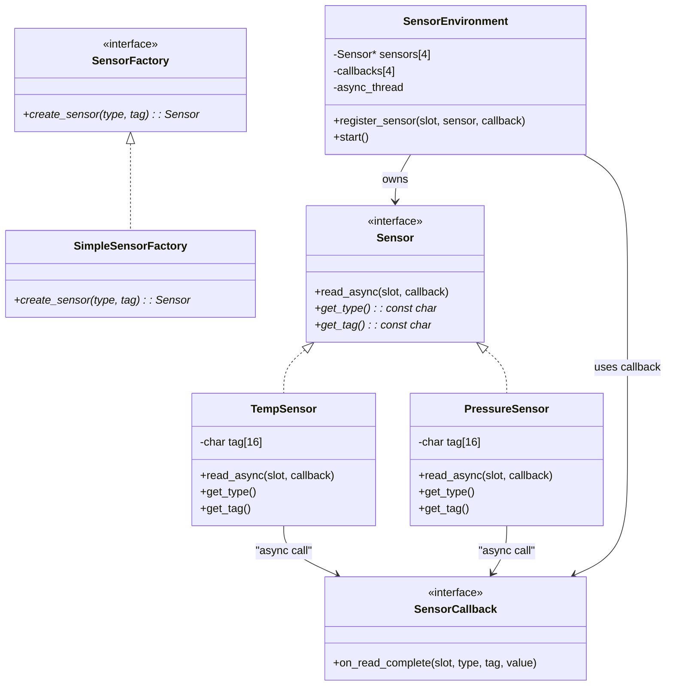
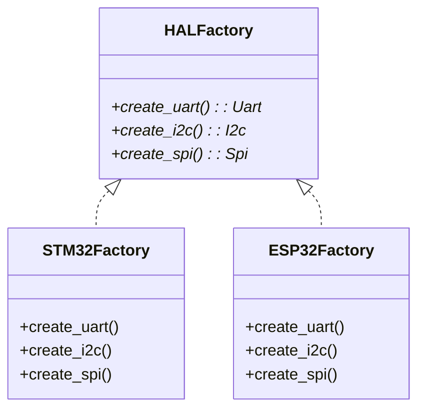

#                                                                                                                                                                                                                                                                                                                                                                                                                                                                                                                                                                                                                                                                                                                                                                                     设计模式

> 前言： 一切以最实用为标准，需要便于代码移植、便于扩展、便于阅读。

## 创建型模式

### 工厂方法

工厂模式，整个代码就像一个个工厂一样，我需要什么东西就让那个工厂制作什么东西。我需要创建在嵌入式开发中，很多的场景都会运用到工厂方法，工厂方法作为一个简单的模式，是非常适合新手去实现的。下面贴上一段代码来进行模拟嵌入式的场景。

```c
/* sensor_factory_async.c
   Factory Method + object pool + IRQ-style async callbacks (no malloc).
   Compile: gcc -std=c11 -O2 sensor_factory_async.c -o sensor_factory_async
*/

#include <stdio.h>
#include <stdint.h>
#include <string.h>
#include <stdbool.h>
#include <unistd.h> /* usleep for demo */

#ifdef _WIN32
#include <windows.h>
#define usleep(us) Sleep((us) / 1000)
#endif

/* ---------- 抽象与回调类型 ---------- */

typedef struct Sensor Sensor;

/* 回调签名：当异步读取完成后调用（在“线程/主循环”上下文执行） */
typedef void (*sensor_callback_t)(Sensor *s, float value, void *ctx);

typedef struct
{
    void (*init)(Sensor *self);
    float (*read)(Sensor *self); /* 同步读取（转换/模拟） */
    const char *(*type_name)(Sensor *self);
    void (*deinit)(Sensor *self);
} SensorVTable;

struct Sensor
{
    const SensorVTable *vptr;
    int id; /* 池索引 */
    /* 异步支持 */
    sensor_callback_t cb;
    void *cb_ctx;
    bool async_enabled;
};

/* ---------- 具体传感器：温度 ---------- */

typedef struct
{
    Sensor base;
    int16_t raw;
    int16_t calibration_offset;
} TempSensor;

static void temp_init(Sensor *s)
{
    TempSensor *t = (TempSensor *)s;
    t->raw = 250;
    t->calibration_offset = 0;
}
static float temp_read(Sensor *s)
{
    TempSensor *t = (TempSensor *)s;
    return (t->raw + t->calibration_offset) / 10.0f;
}
static const char *temp_name(Sensor *s)
{
    (void)s;
    return "TempSensor";
}
static void temp_deinit(Sensor *s) { (void)s; }

static const SensorVTable temp_vtable = {
    .init = temp_init,
    .read = temp_read,
    .type_name = temp_name,
    .deinit = temp_deinit};

/* ---------- 具体传感器：压力 ---------- */

typedef struct
{
    Sensor base;
    uint16_t pressure_raw;
    uint8_t range_kpa;
} PressureSensor;

static void pres_init(Sensor *s)
{
    PressureSensor *p = (PressureSensor *)s;
    p->pressure_raw = 1013;
    p->range_kpa = 100;
}
static float pres_read(Sensor *s)
{
    PressureSensor *p = (PressureSensor *)s;
    return p->pressure_raw / 10.0f;
}
static const char *pres_name(Sensor *s)
{
    (void)s;
    return "PressureSensor";
}
static void pres_deinit(Sensor *s) { (void)s; }

static const SensorVTable pres_vtable = {
    .init = pres_init,
    .read = pres_read,
    .type_name = pres_name,
    .deinit = pres_deinit};

/* ---------- 对象池（无 malloc） ---------- */

#define POOL_SIZE 6
#define MAX_OBJ_SIZE ((sizeof(PressureSensor) > sizeof(TempSensor)) ? sizeof(PressureSensor) : sizeof(TempSensor))

static uint8_t pool[POOL_SIZE][MAX_OBJ_SIZE];
static bool pool_used[POOL_SIZE] = {0};

static int pool_alloc_slot(void)
{
    for (int i = 0; i < POOL_SIZE; ++i)
    {
        if (!pool_used[i])
        {
            pool_used[i] = true;
            return i;
        }
    }
    return -1;
}
static void pool_free_slot(int idx)
{
    if (idx >= 0 && idx < POOL_SIZE)
    {
        pool_used[idx] = false;
        memset(pool[idx], 0, MAX_OBJ_SIZE);
    }
}

/* ---------- 工厂函数 ---------- */

Sensor *create_temp_sensor(int *out_id)
{
    int slot = pool_alloc_slot();
    if (slot < 0)
        return NULL;
    TempSensor *t = (TempSensor *)(void *)pool[slot];
    memset(t, 0, sizeof(TempSensor));
    t->base.vptr = &temp_vtable;
    t->base.id = slot;
    t->base.cb = NULL;
    t->base.cb_ctx = NULL;
    t->base.async_enabled = false;
    t->raw = 0;
    t->calibration_offset = 0;
    t->base.vptr->init((Sensor *)t);
    if (out_id)
        *out_id = slot;
    return (Sensor *)t;
}

Sensor *create_pressure_sensor(int *out_id)
{
    int slot = pool_alloc_slot();
    if (slot < 0)
        return NULL;
    PressureSensor *p = (PressureSensor *)(void *)pool[slot];
    memset(p, 0, sizeof(PressureSensor));
    p->base.vptr = &pres_vtable;
    p->base.id = slot;
    p->base.cb = NULL;
    p->base.cb_ctx = NULL;
    p->base.async_enabled = false;
    p->pressure_raw = 0;
    p->range_kpa = 0;
    p->base.vptr->init((Sensor *)p);
    if (out_id)
        *out_id = slot;
    return (Sensor *)p;
}

void destroy_sensor(Sensor *s)
{
    if (!s)
        return;
    int slot = s->id;
    if (s->vptr && s->vptr->deinit)
        s->vptr->deinit(s);
    pool_free_slot(slot);
}

/* ---------- 事件队列（ISR 推入，主循环处理） ---------- */

#define EVENT_QUEUE_DEPTH 32

typedef struct
{
    Sensor *sensor;
    float value;
} SensorEvent;

static SensorEvent event_queue[EVENT_QUEUE_DEPTH];
static volatile int eq_head = 0; /* next to pop */
static volatile int eq_tail = 0; /* next to push */

/* 在 ISR 上下文调用：尽量小，返回是否推入成功（false => 丢弃事件） */
static bool isr_push_event(Sensor *s, float val)
{
    int next = (eq_tail + 1) % EVENT_QUEUE_DEPTH;
    if (next == eq_head)
    {
        /* 队列满 — 在 ISR 中不能阻塞，丢弃事件或计统计 */
        return false;
    }
    event_queue[eq_tail].sensor = s;
    event_queue[eq_tail].value = val;
    /* 简单的内存屏障（在裸机上可能为简短指令）*/
    __sync_synchronize();
    eq_tail = next;
    return true;
}

/* 主循环调用，处理并调用用户回调（非 ISR） */
static void process_event_queue(void)
{
    while (eq_head != eq_tail)
    {
        SensorEvent ev = event_queue[eq_head];
        eq_head = (eq_head + 1) % EVENT_QUEUE_DEPTH;
        /* 调用注册的回调（如果有） */
        if (ev.sensor && ev.sensor->cb && ev.sensor->async_enabled)
        {
            ev.sensor->cb(ev.sensor, ev.value, ev.sensor->cb_ctx);
        }
    }
}

/* ---------- 硬件中断模拟：在 ISR 中读取硬件并 push_event ---------- */

/* 真实系统中，这个函数会在 ISR 中被调用（或被 ISR 标记/触发）。
   对于示例，我们在 main 的循环中调用它来模拟中断触发。
*/
void hardware_trigger_sensor(Sensor *s)
{
    if (!s)
        return;
    /* ISR: 读取原始数据（通过 vptr->read），然后 push 到队列。
       注意：在真实 ISR 中，可能需要读取硬件寄存器/ADC 而不是调用复杂函数。
    */
    float val = s->vptr->read(s); /* 同步转换，假设快 */
    bool pushed = isr_push_event(s, val);
    (void)pushed; /* 可以统计丢弃率 */
}

/* ---------- 异步 API（供客户端使用） ---------- */

/* 启动异步采样（注册回调） */
void sensor_start_async(Sensor *s, sensor_callback_t cb, void *ctx)
{
    if (!s)
        return;
    s->cb = cb;
    s->cb_ctx = ctx;
    s->async_enabled = true;
}

/* 停止异步采样 */
void sensor_stop_async(Sensor *s)
{
    if (!s)
        return;
    s->async_enabled = false;
    s->cb = NULL;
    s->cb_ctx = NULL;
}

/* ---------- 客户端回调示例 ---------- */

static void my_sensor_cb(Sensor *s, float value, void *ctx)
{
    const char *tag = (const char *)ctx;
    printf("[callback] slot=%d type=%s tag=%s value=%.2f\n", s->id, s->vptr->type_name(s), tag ? tag : "(null)", value);
}

/* ---------- 测试主程序（模拟主循环 + 硬件触发） ---------- */

int main(void)
{
    /* 创建一些传感器 */
    Sensor *t1 = create_temp_sensor(NULL);
    Sensor *p1 = create_pressure_sensor(NULL);
    Sensor *t2 = create_temp_sensor(NULL);

    if (!t1 || !p1 || !t2)
    {
        printf("create failed\n");
        return 1;
    }

    /* 注册异步回调（开始异步模式） */
    sensor_start_async(t1, my_sensor_cb, "T1");
    sensor_start_async(p1, my_sensor_cb, "P1");
    sensor_start_async(t2, my_sensor_cb, "T2");

    /* 主循环：我们每次循环随机“硬件触发”若干传感器，然后处理队列 */
    for (int loop = 0; loop < 20; ++loop)
    {
        /* 模拟硬件更新一些内部原始值（演示） */
        ((TempSensor *)t1)->raw += 1;                                    /* 温度慢慢上升 */
        ((PressureSensor *)p1)->pressure_raw += (loop % 3 == 0) ? 1 : 0; /* 偶尔变化 */
        ((TempSensor *)t2)->raw += (loop % 2 == 0) ? 2 : 0;

        /* 模拟 ISR 触发 — 在真实环境这些会被定时器/外设中断调用 */
        hardware_trigger_sensor(t1);
        hardware_trigger_sensor(p1);
        if (loop % 2 == 0)
            hardware_trigger_sensor(t2);

        /* 主循环处理事件（在此调用回调） */
        process_event_queue();

        usleep(100 * 1000); /* 100ms，示例用 */
    }

    /* 停止并销毁 */
    sensor_stop_async(t1);
    sensor_stop_async(p1);
    sensor_stop_async(t2);

    destroy_sensor(t1);
    destroy_sensor(p1);
    destroy_sensor(t2);

    return 0;
}

```



通过上述的一个demo，我们可以看到所谓`工厂方法`。
他们具有**一样的基类**，能够初始化、能够读取、能够反初始化。
而我们的任务就是去创建一个个的具体的实例，温度传感器、压力传感器怎么去读数据？是需要我们自己去具体实现的。而我们只需要一个**工厂**，工厂去做不同的产品，这才是工厂模式的核心思想。

#### 适用场景

1. **当你在编写代码的过程中，如果无法预知对象确切类别及其依赖关系时，可使用工厂方法。**
2. **如果你希望用户能扩展你软件库或框架的内部组件，可使用工厂方法。**
3. **如果你希望复用现有对象来节省系统资源，而不是每次都重新创建对象，可使用工厂方法。**

> 代码中模拟了ISR也就是中断程序，一般我们会触发中断，把数据添加到队列中，然后在主程序中出队列，把数据取出处理。

### 抽象工厂

有了前面的工厂方法，那么学习抽象工厂就没有很困难了，为什么呢？抽象工厂其实说白了就是好几个工厂的集合，什么意思呢，比如说你在嵌入式开发中，经常需要使用不同的传感器，不同的传感器，获取的方式、协议也不一样，那么我如何去把我想要的柔和在一起呢，那么就是抽象工厂的意义。
```c          
#include <stdio.h>
#include <stdlib.h>

// ==================== 抽象产品接口 ====================

// 抽象传感器接口
typedef struct
{
    void (*read)(void *self);
    void (*init)(void *self);
    int (*get_id)(void *self);
} SensorVTable;

typedef struct
{
    const SensorVTable *vtable;
} Sensor;

// 抽象执行器接口
typedef struct
{
    void (*activate)(void *self);
    void (*deactivate)(void *self);
    int (*get_status)(void *self);
} ActuatorVTable;

typedef struct
{
    const ActuatorVTable *vtable;
} Actuator;

// ==================== 具体产品实现 ====================

// 温度传感器
typedef struct
{
    Sensor base;
    int id;
    float temperature;
} TemperatureSensor;

void temp_sensor_read(void *self)
{
    TemperatureSensor *sensor = (TemperatureSensor *)self;
    sensor->temperature = 25.0f + (rand() % 100) * 0.1f; // 模拟温度读数
    printf("Temperature Sensor %d: %.1f\n", sensor->id, sensor->temperature);
}

void temp_sensor_init(void *self)
{
    TemperatureSensor *sensor = (TemperatureSensor *)self;
    printf("Temperature Sensor %d initialized\n", sensor->id);
}

int temp_sensor_get_id(void *self)
{
    TemperatureSensor *sensor = (TemperatureSensor *)self;
    return sensor->id;
}

static const SensorVTable temp_sensor_vtable = {
    .read = temp_sensor_read,
    .init = temp_sensor_init,
    .get_id = temp_sensor_get_id};

// 湿度传感器
typedef struct
{
    Sensor base;
    int id;
    float humidity;
} HumiditySensor;

void humidity_sensor_read(void *self)
{
    HumiditySensor *sensor = (HumiditySensor *)self;
    sensor->humidity = 40.0f + (rand() % 400) * 0.1f; // 模拟湿度读数
    printf("Humidity Sensor %d: %.1f%%\n", sensor->id, sensor->humidity);
}

void humidity_sensor_init(void *self)
{
    HumiditySensor *sensor = (HumiditySensor *)self;
    printf("Humidity Sensor %d initialized\n", sensor->id);
}

int humidity_sensor_get_id(void *self)
{
    HumiditySensor *sensor = (HumiditySensor *)self;
    return sensor->id;
}

static const SensorVTable humidity_sensor_vtable = {
    .read = humidity_sensor_read,
    .init = humidity_sensor_init,
    .get_id = humidity_sensor_get_id};

// LED执行器
typedef struct
{
    Actuator base;
    int id;
    int is_on;
} LedActuator;

void led_activate(void *self)
{
    LedActuator *led = (LedActuator *)self;
    led->is_on = 1;
    printf("LED %d: ON\n", led->id);
}

void led_deactivate(void *self)
{
    LedActuator *led = (LedActuator *)self;
    led->is_on = 0;
    printf("LED %d: OFF\n", led->id);
}

int led_get_status(void *self)
{
    LedActuator *led = (LedActuator *)self;
    return led->is_on;
}

static const ActuatorVTable led_vtable = {
    .activate = led_activate,
    .deactivate = led_deactivate,
    .get_status = led_get_status};

// 电机执行器
typedef struct
{
    Actuator base;
    int id;
    int speed;
    int is_running;
} MotorActuator;

void motor_activate(void *self)
{
    MotorActuator *motor = (MotorActuator *)self;
    motor->is_running = 1;
    motor->speed = 100;
    printf("Motor %d: Running at %d%% speed\n", motor->id, motor->speed);
}

void motor_deactivate(void *self)
{
    MotorActuator *motor = (MotorActuator *)self;
    motor->is_running = 0;
    motor->speed = 0;
    printf("Motor %d: Stopped\n", motor->id);
}

int motor_get_status(void *self)
{
    MotorActuator *motor = (MotorActuator *)self;
    return motor->is_running;
}

static const ActuatorVTable motor_vtable = {
    .activate = motor_activate,
    .deactivate = motor_deactivate,
    .get_status = motor_get_status};

// ==================== 抽象工厂接口 ====================

typedef struct
{
    Sensor *(*create_sensor)(int id);
    Actuator *(*create_actuator)(int id);
} DeviceFactory;

// ==================== 具体工厂实现 ====================

// 环境监测工厂 - 创建温度传感器和LED
Sensor *create_environment_sensor(int id)
{
    static TemperatureSensor sensor;
    sensor.base.vtable = &temp_sensor_vtable;
    sensor.id = id;
    sensor.temperature = 0.0f;
    sensor.base.vtable->init(&sensor);
    return (Sensor *)&sensor;
}

Actuator *create_environment_actuator(int id)
{
    static LedActuator actuator;
    actuator.base.vtable = &led_vtable;
    actuator.id = id;
    actuator.is_on = 0;
    return (Actuator *)&actuator;
}

// 运动控制工厂 - 创建湿度传感器和电机
Sensor *create_motion_sensor(int id)
{
    static HumiditySensor sensor;
    sensor.base.vtable = &humidity_sensor_vtable;
    sensor.id = id;
    sensor.humidity = 0.0f;
    sensor.base.vtable->init(&sensor);
    return (Sensor *)&sensor;
}

Actuator *create_motion_actuator(int id)
{
    static MotorActuator actuator;
    actuator.base.vtable = &motor_vtable;
    actuator.id = id;
    actuator.is_running = 0;
    actuator.speed = 0;
    return (Actuator *)&actuator;
}

// 全局工厂实例
const DeviceFactory EnvironmentFactory = {
    .create_sensor = create_environment_sensor,
    .create_actuator = create_environment_actuator};

const DeviceFactory MotionFactory = {
    .create_sensor = create_motion_sensor,
    .create_actuator = create_motion_actuator};

// ==================== 客户端代码 ====================

void test_device_system(const DeviceFactory *factory, int sensor_id, int actuator_id)
{
    printf("\n=== Creating devices from factory ===\n");

    // 使用工厂创建产品
    Sensor *sensor = factory->create_sensor(sensor_id);
    Actuator *actuator = factory->create_actuator(actuator_id);

    // 使用抽象接口操作产品
    printf("Testing devices:\n");
    sensor->vtable->read(sensor);
    actuator->vtable->activate(actuator);

    // 可以安全地向下转型调用具体方法
    if (factory == &EnvironmentFactory)
    {
        TemperatureSensor *temp_sensor = (TemperatureSensor *)sensor;
        LedActuator *led = (LedActuator *)actuator;
        printf("Environment devices: Temp Sensor %d, LED %d\n",
               temp_sensor->id, led->id);
    }
    else
    {
        HumiditySensor *humidity_sensor = (HumiditySensor *)sensor;
        MotorActuator *motor = (MotorActuator *)actuator;
        printf("Motion devices: Humidity Sensor %d, Motor %d\n",
               humidity_sensor->id, motor->id);
    }
}

int main(void)
{
    printf("=== Embedded Abstract Factory Demo ===\n");

    // 使用环境监测工厂
    test_device_system(&EnvironmentFactory, 101, 201);

    // 使用运动控制工厂
    test_device_system(&MotionFactory, 102, 202);

    // 再次使用环境监测工厂创建另一组设备
    test_device_system(&EnvironmentFactory, 103, 203);

    return 0;
}
```


#### 适用场景

1. **如果代码需要与多个不同系列的相关产品交互，但是由于无法提前获取相关信息，或者出于对未来扩展性的考虑，你不希望代码基于产品的具体类进行构建，在这种情况下，你可以使用抽象工厂**           
2. **如果你有一个基于一组抽象方法的类，且其主要功能因此变得不明确，那么在这种情况下可以考虑使用抽象工厂模式**                                                                                                                                                                                        

### 生成器

```c
uart_builder_t b;
uart_builder_init(&b);
uart_set_baud(&b, 115200);
uart_set_parity(&b, 0);
uart_set_stop_bits(&b, 1);

uart_config_t cfg = uart_build(&b);
```

#### 适用场景

参数比较多的情况，比如UART的参数设置初始化、SPI的初始化

### 原型

原型就是复制，有一部分公共的属性，在公共属性上分出额外的实例。

```c
i2c_driver_t drv_template = {
    .timeout = 10,
    .mode    = I2C_MODE_MASTER,
};

i2c_driver_t dev1 = drv_template;
dev1.addr = 0x40;

i2c_driver_t dev2 = drv_template;
dev2.addr = 0x5A;

```

#### 适用场景

如上述举例IIC一样

### 单例

单例就是静态变量+函数调用

```c
static uint8_t reset_flag;


uint8_t get_reset_flag(void) {
    return reset_flag;
}
```

#### 适用场景

目前开发中使用场景的很多，但是违反了单一职责原则，因为不仅要管理业务还要管理生命周期。

## 结构型模式

### 适配器

所谓适配器顾名思义就是进行适配，是什么意思呢，就是进行适配，说的粗俗一点就是再“封装一层”

```c
uint8_t get_sensor(sensor_handler* handler) {
    return function_one(handler);
}

uint8_t get_sensor(sensor_handler* handler) {
    float recv_data = 0.01;
    return function_two(handler,&recv_data);
}
```

这是一个简单的适配器，这里的作用可以看到如果我们应用层需要对代码进行调用，那么只需要调用`uint8_t get_sensor(sensor_handler* handler)`函数

至于里面的细节，只需要在进行移植的时候进行修改即可。

#### 适用场景

适用于一些解耦，便于移植，应用层的逻辑不需要进行修改

### 桥接

桥接其实已经很早就使用了，在做lcd库的时候就使用的是桥接模式，下面是一个简单的例子。
```c
static void spi_init(void) {
    // 初始化 SPI 和 ST7789
}

static void spi_draw_pixel(int x, int y, uint16_t color) {
    // 通过 SPI 写入像素
}

static void spi_refresh(void) {
    // ST7789 通常不需要刷新
}

DisplayDriver spi_driver = {
    .init = spi_init,
    .draw_pixel = spi_draw_pixel,
    .refresh = spi_refresh
};


static void i2c_init(void) {
    // 初始化 I2C 和 SSD1306
}

static void i2c_draw_pixel(int x, int y, uint16_t color) {
    // 写入 buffer，等待刷新
}

static void i2c_refresh(void) {
    // 将整帧 buffer 所有数据写入 SSD1306
}

DisplayDriver i2c_driver = {
    .init = i2c_init,
    .draw_pixel = i2c_draw_pixel,
    .refresh = i2c_refresh
};


int main(void)
{
    Display disp;

    // 使用 SPI 屏
    disp.driver = &spi_driver;
    display_init(&disp);
    display_draw_pixel(&disp, 10, 10, 0xF800);
    display_refresh(&disp);

    // 切换为 I2C 屏（只需改指针）
    disp.driver = &i2c_driver;
    display_init(&disp);
    display_draw_pixel(&disp, 10, 10, 0x07E0);
    display_refresh(&disp);

    while (1) {}
}

```

句柄+实现，就是所谓的桥接模式，客户端（APP）只需要注册对应的句柄，然后传入进去，就可以执行对应的内容。
#### 适用场景

**1. 如果你想要拆分或重组一个具有多重功能的庞杂类（例如能与多个数据库服务器进行交互的类），可以使用桥接模式。**

**2. 如果你希望在几个独立维度上扩展一个类，可使用该模式。**

**3. 如果你需要在运行时切换不同实现方法，可使用桥接模式**

### 组合

### 装饰

### 外观

### 享元

### 代理


## 行为模式

### 责任链

### 命令

### 中介者

### 备忘录

### 观察者

### 状态

### 策略

### 模板方法

### 访问者

# 附件



-----

# EX：

1. 创建型 + 结构型 
   1. 抽象工厂 + 桥接	驱动/硬件抽象最佳组合 
   2. 抽象工厂 + 适配器    底层 HAL 替换、第三方接口兼容
   3. 建造者 + 外观            构建 Profile/配置 + 简化 API
2. 结构型 + 行为型
   1. 组合 + 观察者            树结构 + 事件系统
   2. 桥接 + 装饰者           增强功能（CRC/加密/日志）
   3. 代理 + 策略               数据访问代理 + 多策略切换
3. 创建型 + 行为型 
   1. 工厂 + 策略		动态选择算法/通信方式
   2. 单例 + 观察者             全局事件中心
4. 三者联合
   1. 抽象工厂 + 桥接 + 状态机      大型通信/协议栈架构
   2. 组合 + 装饰 + 策略                  复杂 GUI/系统模块管理


# Best 

## 1. 抽象工厂 + 适配器（驱动跨平台核心）

 **抽象接口**

```c

// uart.h
#ifndef UART_H
#define UART_H

#include <stdint.h>

typedef struct {
    void (*init)(void);
    void (*send)(const uint8_t *data, uint16_t len);
} UART_Interface;

#endif

```

**STM32 适配器实现**

```
// stm32_uart.c
#include "uart.h"
#include <stdio.h>

// 模拟 STM32 底层驱动
static void stm32_uart_hw_init(void){ 
	printf("STM32 UART init\n"); 
}
static void stm32_uart_hw_send(const uint8_t *d, uint16_t l){
	printf("STM32 send %d bytes\n", l); 
}

static void stm32_init(void){
	stm32_uart_hw_init(); 
}

static void stm32_send(const uint8_t *d, uint16_t l){
	stm32_uart_hw_send(d, l); 
}

UART_Interface UART_STM32 = {
    .init = stm32_init,
    .send = stm32_send,
};

```

**LE5010适配器实现**

```c
// le5010_uart.c
#include "uart.h"
#include <stdio.h>

// 模拟 LE5010 硬件
static void le5010_hw_init(void) { 
    printf("LE5010 UART init\n"); 
}
static void le5010_hw_send(const uint8_t *d, uint16_t l){
    printf("LE5010 send %d bytes\n", l);
}

static void le5010_init(void){
    le5010_hw_init(); 
}
static void le5010_send(const uint8_t *d, uint16_t l){
    le5010_hw_send(d, l); 
}

UART_Interface UART_LE5010 = {
    .init = le5010_init,
    .send = le5010_send,
};

```

**抽象工厂**

```c
// factory.h
#ifndef FACTORY_H
#define FACTORY_H

#include "uart.h"

typedef struct {
    UART_Interface* (*create_uart)(void);
} HAL_Factory;

#endif

```

**STM32工厂**

```c
// stm32_factory.c
#include "factory.h"
extern UART_Interface UART_STM32;

static UART_Interface* create_uart_stm32(void) {
    return &UART_STM32;
}

HAL_Factory STM32_Factory = {
    .create_uart = create_uart_stm32,
};

```

**LE5010工厂**

```c
// le5010_factory.c
#include "factory.h"
extern UART_Interface UART_LE5010;

static UART_Interface* create_uart_le5010(void){
    return &UART_LE5010;
}

HAL_Factory LE5010_Factory = {
    .create_uart = create_uart_le5010,
};

```

**使用**

```c
#include "factory.h"
#include <string.h>

extern HAL_Factory STM32_Factory;
extern HAL_Factory LE5010_Factory;

int main(){
    HAL_Factory *f = &LE5010_Factory; // 切换平台只需改这一行

    UART_Interface *uart = f->create_uart();
    uart->init();

    uint8_t msg[] = "hello";
    uart->send(msg, sizeof(msg));

    return 0;
}
```


## 2. 策略 + 状态机（协议与复杂逻辑）

```c
//策略接口
typedef struct {
    uint8_t (*encrypt)(uint8_t data);
} EncryptStrategy;


// 具体策略
uint8_t xor_encrypt(uint8_t d){ return d ^ 0xAA; }

EncryptStrategy XOR_Encrypt = {
    .encrypt = xor_encrypt
};


// 具体策略
uint8_t add1_encrypt(uint8_t d){ return d + 1; }

EncryptStrategy ADD1_Encrypt = {
    .encrypt = add1_encrypt
};


// 状态机状态
typedef enum {
    ST_INIT,
    ST_ADV,
    ST_CONNECTED,
} BLE_State;

//状态机结构
typedef struct {
    BLE_State state;
    EncryptStrategy *strategy;

    void (*run)(void* self, uint8_t raw_data);
} BLE_Context;


// 状态机行为
#include <stdio.h>

void run_ble(void* self, uint8_t raw)
{
    BLE_Context *c = (BLE_Context*)self;

    switch(c->state){
        case ST_INIT:
            printf("BLE: Init\n");
            c->state = ST_ADV;
            break;

        case ST_ADV:
            printf("BLE: Advertising\n");
            c->state = ST_CONNECTED;
            break;

        case ST_CONNECTED: {
            uint8_t enc = c->strategy->encrypt(raw);
            printf("BLE: Connected, encrypted data = %02X\n", enc);
            break;
        }
    }
}


// 使用
int main(){
    BLE_Context ctx = {
        .state = ST_INIT,
        .strategy = &XOR_Encrypt,
        .run = run_ble,
    };

    ctx.run(&ctx, 0x10);
    ctx.run(&ctx, 0x10);
    ctx.run(&ctx, 0x10);

    // 改用加一算法
    ctx.strategy = &ADD1_Encrypt;
    ctx.run(&ctx, 0x10);

    return 0;
}


```


## 3. 观察者 + 单例（事件系统）

```c
// 单例事件中心
#define MAX_OBSERVERS 5

typedef void (*EventHandler)(int event);

typedef struct {
    EventHandler handlers[MAX_OBSERVERS];
    int count;
} EventCenter;

static EventCenter g_event_center;   // 单例


// 添加观察者
void event_register(EventHandler h){
    if(g_event_center.count < MAX_OBSERVERS){
        g_event_center.handlers[g_event_center.count++] = h;
    }
}

// 事件广播
void event_emit(int event){
    for(int i=0;i<g_event_center.count;i++){
        g_event_center.handlers[i](event);
    }
}


// 用户模块
#include <stdio.h>

void taskA_handler(int e){ printf("TaskA received event %d\n", e); }
void taskB_handler(int e){ printf("TaskB received event %d\n", e); }


// 使用
int main(){
    event_register(taskA_handler);
    event_register(taskB_handler);

    event_emit(100);   // 模拟按键触发

    return 0;
}

```


## 4.桥接 + 抽象工厂（将平台与逻辑分开）

 **暂无示例，具体直接看git仓库：https://github.com/XiaoyuZZzz/Stupid-child.git**


抽象工厂创建不同的硬件如SPI_Trans、IIC_Trans、UART_Trans
桥接将句柄和实现分开，通过调用句柄，句柄指向的对应的函数。应用层和底层之间进行解耦。
